# WordEcho

Application to read in your target language, save unfamiliar words, and review them later with a spaced repetition system. Build your vocabulary naturally while enjoying immersive reading.


---
### **Usage**

#### 1. First Launch
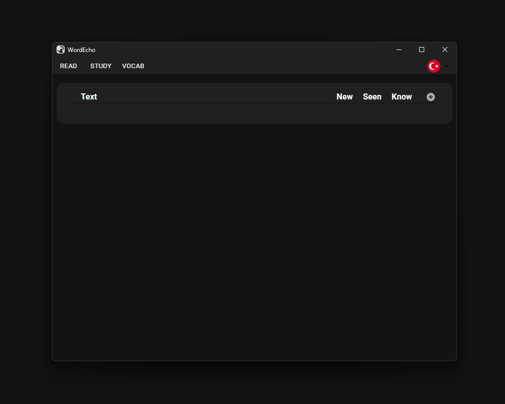

#### 2. Select Your Target Language
For this example, let's say you select German.

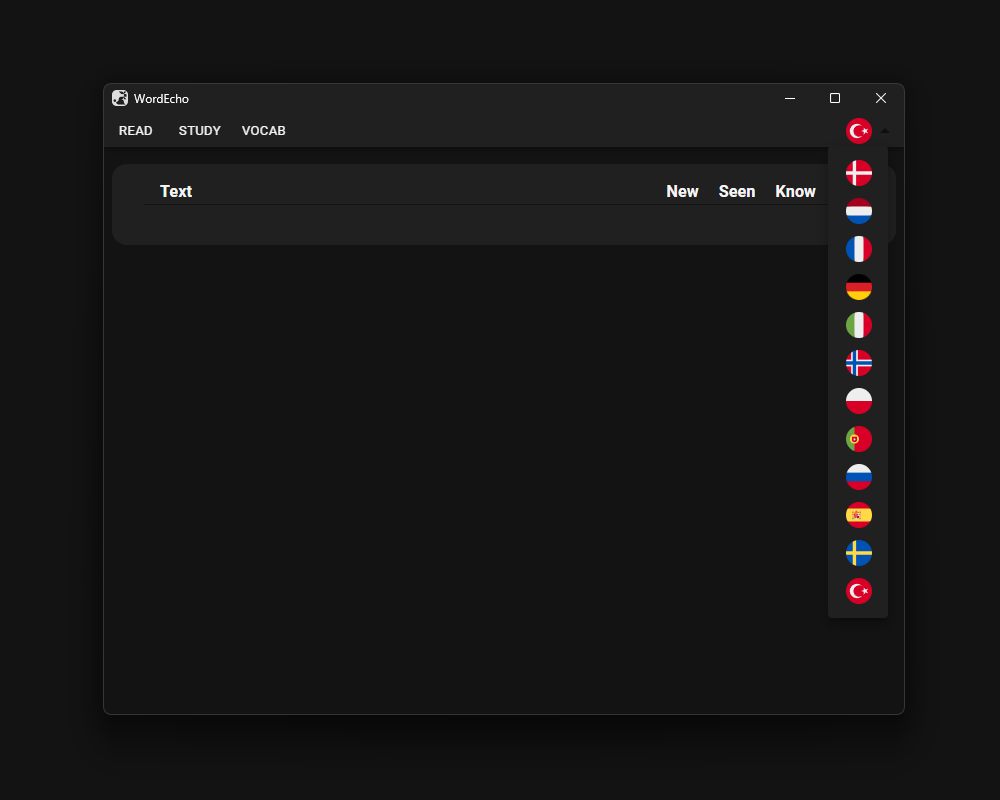

#### 3. Press the Circular Plus Icon
For better visibility, switch to fullscreen.

This page allows you to add new texts in your target language.

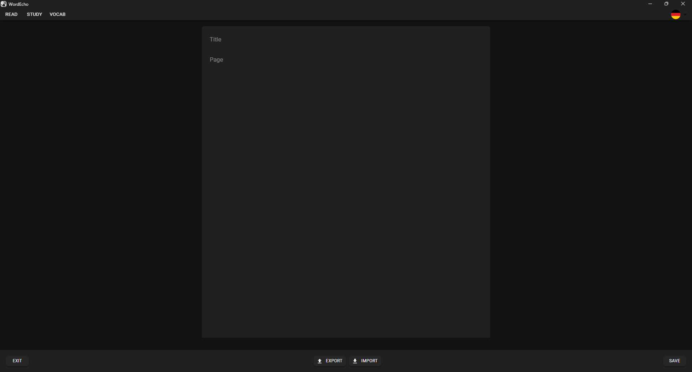

Simply enter a title and the page content. You can find the text used here: [https://lingua.com/german/reading/freizeitgestaltung/](https://lingua.com/german/reading/freizeitgestaltung/).  
After pasting the text, press **SAVE** and then **EXIT** to return to the starting page.

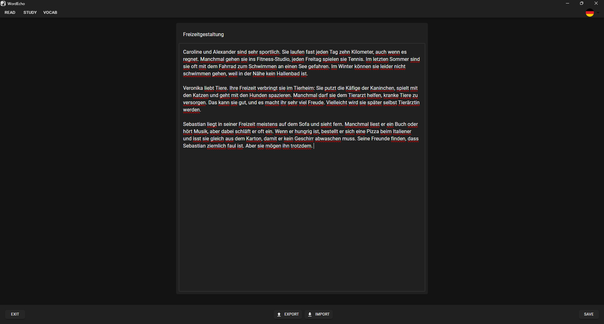

#### 4. Select the Text You Want to Read
In this case, you only have one text to choose from, but you can add as many texts as you want.

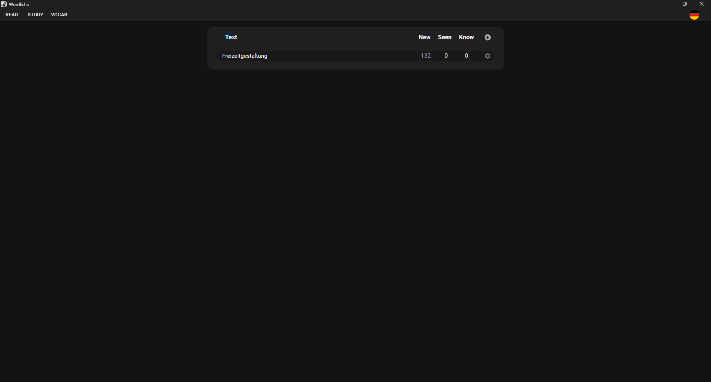

After selecting a text, the reading page will open. On this page, you’ll see the text on the left and a sidebar on the right. All words are saved to your vocabulary. To update the state of a word, simply click on it.

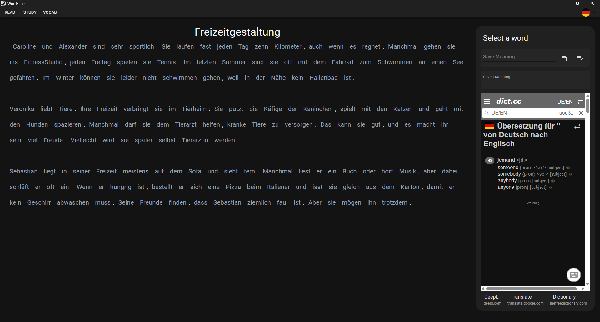

After clicking the word "und," the selected word appears on the sidebar, and the dictionary displays translations for the selected word. For further clarification, you can click the links under the dictionary to open different translation websites.

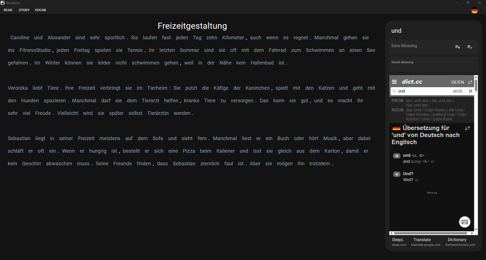

After entering the meaning of the word, you can add it to "seen words" or mark it as "known." Adding a word to "seen words" means you don’t know the word yet but have encountered it. These words can be reviewed later using a spaced repetition system, so it’s important to add words you want to practice. Marking a word as "known" ensures the application doesn’t show it during review sessions, as it’s considered a word you already know.

You can always change the state of words by clicking the other button or delete the word entirely from your vocabulary on the vocabulary page (covered later).

Here, the word has been added to "seen words," and its color changes from silver to white, indicating that it is no longer a new word.

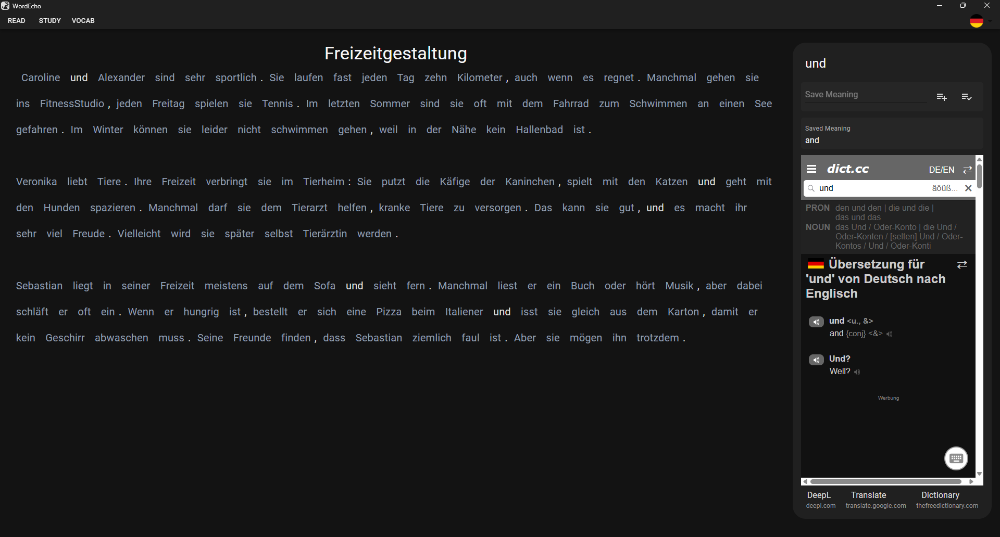

#### 5. Go to the VOCAB Page
At this point, you’ve saved the first sentence. You marked names and the word "kilometer" as known because you don’t need to learn them. For other words, you added them to "seen words." Here, you can see that "seen words" have different values like **Level**, **Haze**, and **Days**:
- **Level**: How well you know the word.
- **Haze**: How difficult it is for you to remember the word.
- **Days**: How many days remain until you need to review the word again.

Since you just saved the words, they need to be reviewed immediately.

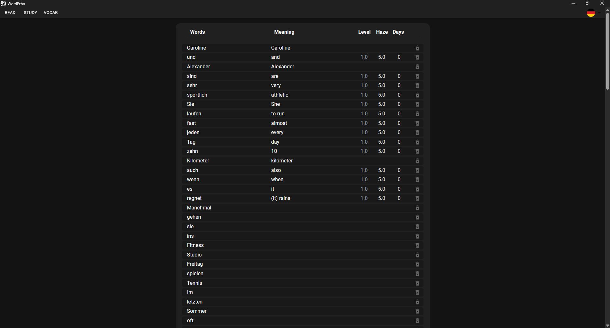

#### 6. Go to the STUDY Page
On this page, you review your words to practice and learn them. When you first open the page, you’ll see your first word at the top and a button at the bottom to show the meaning of the word. Before showing the answer, try to recall the meaning of the word.

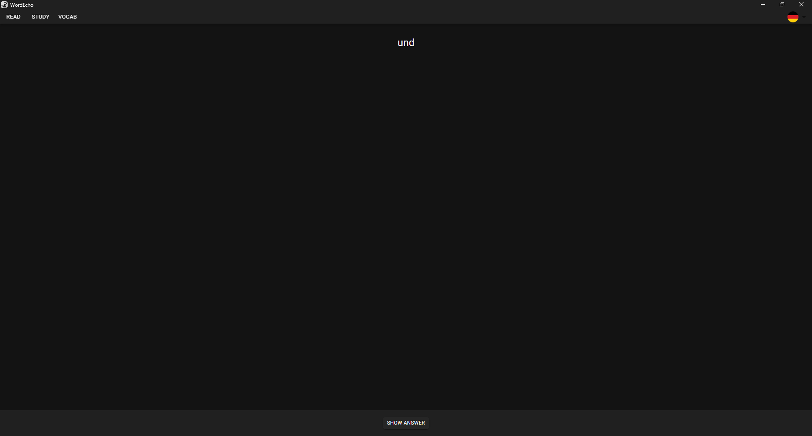

After clicking the button, you can see the saved meaning under the word. Below, there are four buttons to indicate how hard it was to recall the word:
- If it was easy, click **EASY**.
- If it was not so easy, click **GOOD**.
- If it was difficult, click **HARD**.
- If you couldn’t recall the word, click **CAN’T**.

These buttons help the application optimize the review schedule.

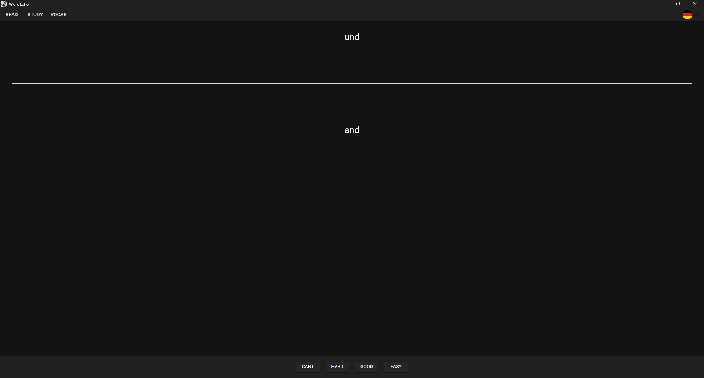

After reviewing the remaining words, you can see stats about the words you’re learning. Words you recalled easily now have a higher **Level**, and the **Haze** of every word is lower because you’ve studied them once. The **Days** column now shows that there is 1 day remaining until the next review. The due date is the same for all words initially but will vary over time as the application fine-tunes the review schedule.

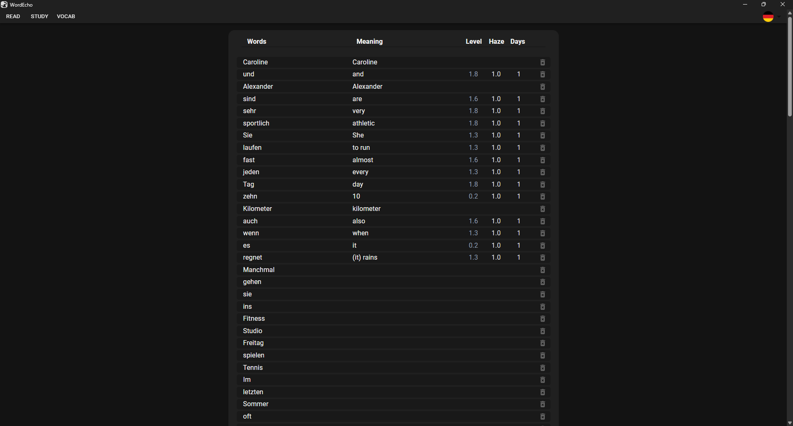

---
## Installation

You can find redy to use packages in release section.

If you want to build this project yourself:

1. Clone the repository:
   ```bash
   git clone https://github.com/WordEcho/WordEcho.git
   ```
2. Navigate to the project directory:
   ```bash
   cd WordEcho
   ```
3. Install the required dependencies:
   ```bash
   npm install
   npm install --global @tauri-apps/cli
   ```
4. Build the application:
   ```bash
   npm run tauri build
   ```
More information can be found at: https://tauri.app/

---

## License

WordEcho is licensed under the Attribution-NonCommercial 4.0 International
